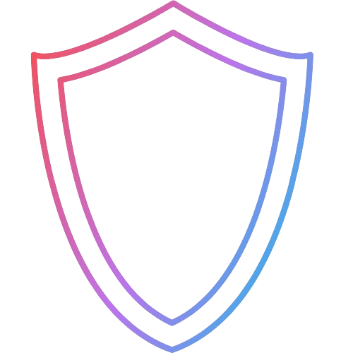
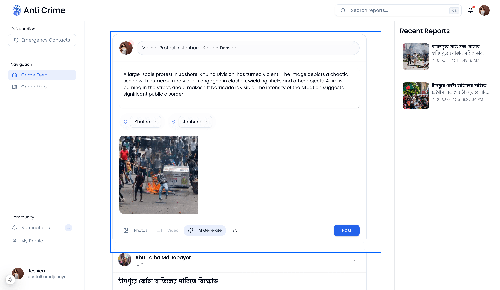
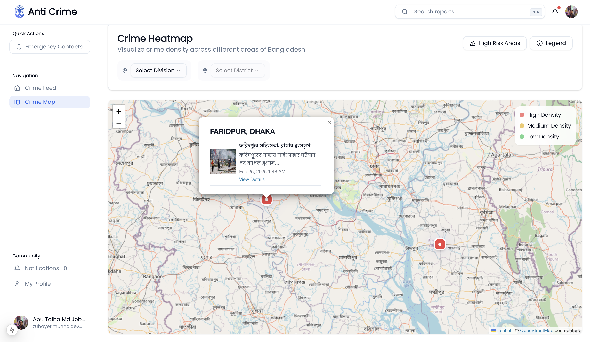
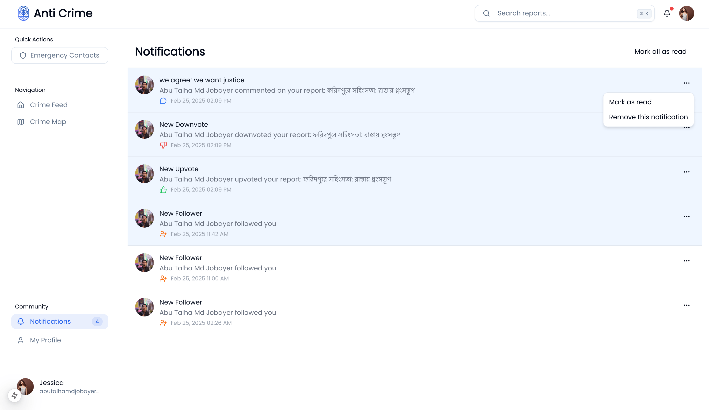

<div align="center">
  
  
  # Anti-Crime Platform
  
  <p>
    <strong>A community-driven crime reporting and tracking platform powered by AI</strong>
  </p>
  
  <p>
    <a href="#-features">Features</a> •
    <a href="#%EF%B8%8F-tech-stack">Tech Stack</a> •
    <a href="#-getting-started">Quick Start</a> •
    <a href="#-contributing">Contributing</a>
  </p>

  <p>
    <a href="https://github.com/abujobayer0/anti-crime/stargazers">
      
    </a>
    <a href="https://github.com/abujobayer0/anti-crime/network/members">
      
    </a>
    <a href="https://github.com/abujobayer0/anti-crime/issues">
      
    </a>
  </p>
</div>

## 🌟 **Overview**

**Anti-Crime** is a modern, AI-powered web platform designed to empower communities to report, track, and visualize criminal activities. With real-time insights and AI-driven analysis, the platform transforms crime data into actionable information, helping users make their neighborhoods safer.

## ✨ **Features**

<div align="center">
  <table>
    <tr>
      <td align="center">
        <br>
        <strong>AI-Powered Reports</strong><br>
        Generate detailed reports using AI
      </td>
      <td align="center">
        <br>
        <strong>Crime Heatmap</strong><br>
        Visualize crime hotspots
      </td>
      <td align="center">
        <br>
        <strong>Real-Time Updates</strong><br>
        Stay informed instantly
      </td>
    </tr>
  </table>
</div>

- **AI-Powered Report Generation**: Harnessing the power of Google's **Gemini AI**, automatically generate detailed crime reports from uploaded images.
- **Interactive Crime Heatmap**: Visualize crime hotspots and track patterns in your area.
- **Real-Time Updates**: Stay informed with notifications and the latest reports.
- **Community Engagement**: Allow users to upvote, downvote, and comment on crime reports.
- **Multi-Language Support**: Available in both **English** and **Bengali** for wider accessibility.
- **Verified Reporting**: A user verification system ensures credible and accurate crime reports.
- **Evidence Management**: Supports multiple images and videos to back up crime reports.
- **Mobile Optimized**: Fully responsive for a seamless experience on any device.

## 🛠️ **Tech Stack**

<div align="center">
  <table>
    <tr>
      <td align="center"><br>Next.js</td>
      <td align="center"><br>TypeScript</td>
      <td align="center"><br>Tailwind</td>
      <td align="center"><br>shadcn/ui</td>
    </tr>
  </table>
</div>

- **Framework**: [Next.js 15.1.7 (App Router)](https://nextjs.org/)
- **Language**: [TypeScript](https://www.typescriptlang.org/)
- **Styling**: [Tailwind CSS](https://tailwindcss.com/)
- **UI Components**: [shadcn/ui](https://ui.shadcn.com/)
- **State Management**: [Redux Toolkit](https://redux-toolkit.js.org/)
- **Data Fetching**: [TanStack Query](https://tanstack.com/query)
- **AI Integration**: [Google Gemini API](https://deepmind.google/technologies/gemini/)
- **Maps**: [Leaflet.js](https://leafletjs.com/)
- **Authentication**: JWT
- **Form Handling**: [React Hook Form](https://react-hook-form.com/)

## 🚀 **Getting Started**

To get started with **Anti-Crime** locally, follow these steps:

1. **Clone the repository**:

   ```bash
   git clone https://github.com/abujobayer0/anti-crime.git
   cd anti-crime
   ```

2. **Install dependencies**:

   ```bash
   bun install
   ```

3. **Create a `.env` file**:

   ```bash
   cp .env.example .env
   ```

4. **Start the development server**:

   ```bash
   bun dev
   ```

## 📦 **Environment Variables**

To configure your environment, create a `.env` file in the root directory and add the following variables:

```bash
cp .env.example .env
```

## 🤝 Contributing

Contributions are welcome! Please follow these steps:

1. Fork the repository.
2. Create a new branch.
3. Make your changes and commit them.
4. Push to your fork and create a pull request.

## 📝 License

This project is licensed under the MIT License. See the [LICENSE](LICENSE) file for details.

## 🙏 Acknowledgments

- [shadcn/ui](https://ui.shadcn.com/) for the beautiful UI components
- [Google Gemini](https://deepmind.google/technologies/gemini/) for AI capabilities
- [Leaflet](https://leafletjs.com/) for mapping functionality

---

<div align="center">

## 👨‍💻 Author

**Abu Talha Md Jobayer**

[](https://github.com/abujobayer0)
[](https://www.linkedin.com/in/abutalhamdjobayer/)

<p align="center">⭐ Star this repository if you find it helpful!</p>

</div>
